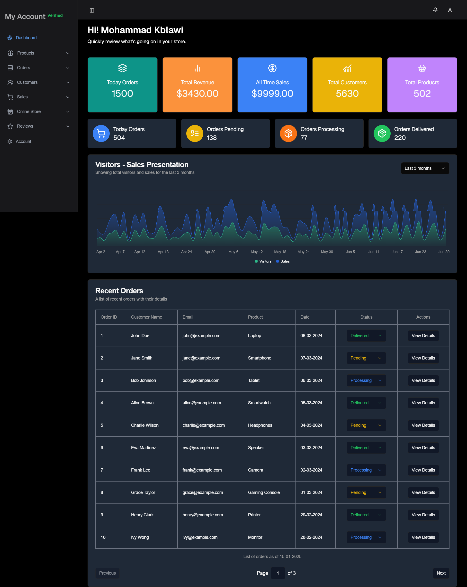

# crafty
Ecommerce Market Place
# My Project with Next.js and ShadCN

This project leverages Next.js with ShadCN for a modern, clean UI.

## Crafty Dashboard


## Crafty Home


### Features
- **Next.js**: Powerful React-based framework.
- **ShadCN**: Styled components for an elegant design.
- **TailwindCSS**: For fast and customizable styling.

### Installation
1. Clone the repository.
2. Install dependencies:
   ```bash
   npm install

